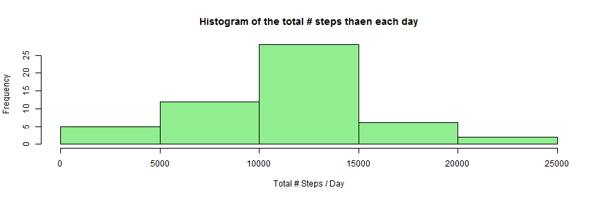
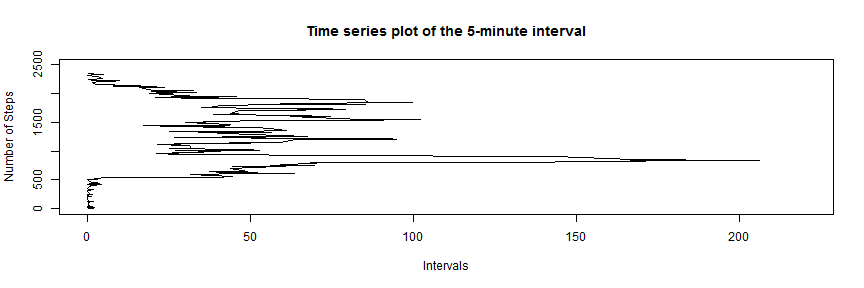
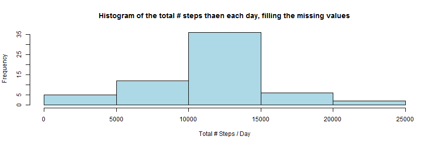
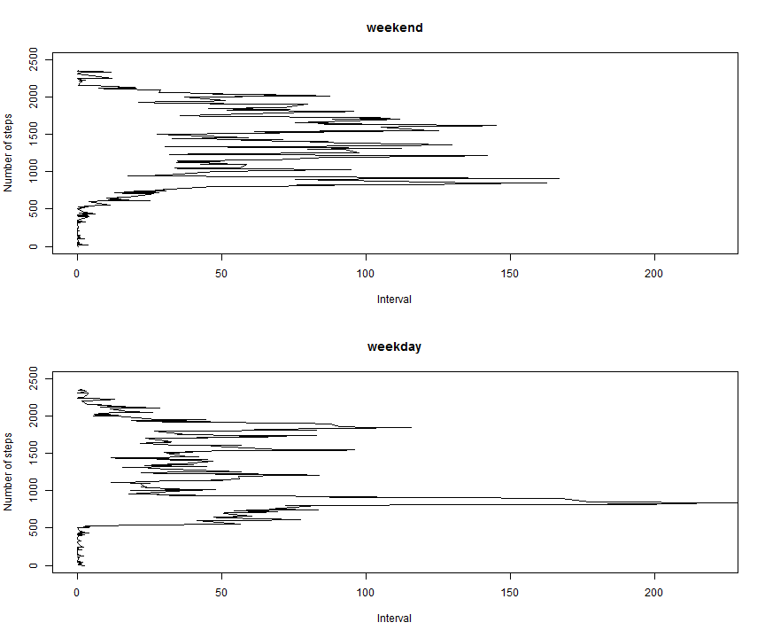

# Reproducible Research: Peer Assessment 1

## Loading and preprocessing the data

```r
   act <- read.csv("activity.csv")

   ok <- complete.cases(act)
  
   agrDate <- aggregate(act[ok,]$steps,by=list(act[ok,]$date), FUN = sum)

   names(agrDate)[1] <- "date"
   names(agrDate)[2] <- "steps"

   head(agrDate) 
```

```
##         date steps
## 1 2012-10-02   126
## 2 2012-10-03 11352
## 3 2012-10-04 12116
## 4 2012-10-05 13294
## 5 2012-10-06 15420
## 6 2012-10-07 11015
```

## What is mean total number of steps taken per day?

### Histogram of total steps per day, excluding missing values

```r
   hist(agrDate$steps,col="light green",main="Histogram of the total # steps thaen each day",
        xlab="Total # Steps / Day") 
```

 

### Mean of total steps taken per day

```r
   mean(agrDate$steps)
```

```
## [1] 10766
```

### Median of total steps taken per day

```r
   median(agrDate$steps)
```

```
## [1] 10765
```

## What is the average daily activity pattern?

### Aggregate steps by interval

```r
   agrInterval <- aggregate(act[ok,]$steps,by=list(act[ok,]$interval), FUN = mean)

   names(agrInterval)[1] <- "interval"
   names(agrInterval)[2] <- "steps"

   head(agrInterval)
```

```
##   interval   steps
## 1        0 1.71698
## 2        5 0.33962
## 3       10 0.13208
## 4       15 0.15094
## 5       20 0.07547
## 6       25 2.09434
```

### Time series plot of the 5-minute interval

```r
   plot(agrInterval$steps,agrInterval$interval,type="l",main="Time series plot of the 5-minute interval",
        xlab="Intervals",ylab="Number of Steps",xlim=c(0, 220), ylim=c(0, 2500))
```

 

## Imputing missing values

### Total rows with missing values

```r
   nrow(act[!ok,])
```

```
## [1] 2304
```

### The missing values will be filled with the mean of respective interval

```r
   intervalNA <- unique(act[!ok,]$interval)

   ajusted <- act
   
   for(i in intervalNA)
   {
       newValue <- unique(agrInterval[agrInterval$interval == i,]$step)

       fillNA <- ajusted$interval == i & is.na(ajusted$step)

       ajusted[fillNA,1] <- newValue
   }
```

### Histogram of total steps per day, filling the missing values

```r
   agrDateAjusted <- aggregate(ajusted$steps,by=list(ajusted$date), FUN = sum)

   names(agrDateAjusted)[1] <- "date"
   names(agrDateAjusted)[2] <- "steps"

   head(agrDateAjusted)
```

```
##         date steps
## 1 2012-10-01 10766
## 2 2012-10-02   126
## 3 2012-10-03 11352
## 4 2012-10-04 12116
## 5 2012-10-05 13294
## 6 2012-10-06 15420
```

```r
   hist(agrDateAjusted$steps,col="light blue",
        main="Histogram of the total # steps thaen each day, filling the missing values",
        xlab="Total # Steps / Day")
```

 

### Mean of total steps taken per day, filling the missing values

```r
   mean(agrDateAjusted$steps)
```

```
## [1] 10766
```

### Median of total steps taken per day, filling the missing values

```r
   median(agrDateAjusted$steps)
```

```
## [1] 10766
```

** Filling the missing values made the median igual the mean and the distribution will be a little bit less right skewed.** 

## Are there differences in activity patterns between weekdays and weekends?

### Create a new variable with the information of weekday and weekend

```r
   ajusted$period <- factor(NA,levels=c("weekday","weekend"))

   ajusted$period <- ifelse(weekdays(as.Date(ajusted$date),abbreviate=TRUE) %in% c("Sat","Sun"),
                            "weekend","weekday")   

   agrIntervalAjusted <- aggregate(ajusted$steps,by=list(ajusted$interval,ajusted$period), FUN = mean)

   names(agrIntervalAjusted)[1] <- "interval"
   names(agrIntervalAjusted)[2] <- "period"
   names(agrIntervalAjusted)[3] <- "steps"

   head(agrIntervalAjusted); tail(agrIntervalAjusted)
```

```
##   interval  period   steps
## 1        0 weekday 2.25115
## 2        5 weekday 0.44528
## 3       10 weekday 0.17317
## 4       15 weekday 0.19790
## 5       20 weekday 0.09895
## 6       25 weekday 1.59036
```

```
##     interval  period   steps
## 571     2330 weekend  1.3880
## 572     2335 weekend 11.5873
## 573     2340 weekend  6.2877
## 574     2345 weekend  1.7052
## 575     2350 weekend  0.0283
## 576     2355 weekend  0.1344
```

### Panel plot containing a time series plot with weekend and weekday data

```r
   pwDay <- agrIntervalAjusted[agrIntervalAjusted$period == "weekday",]

   pwEnd <- agrIntervalAjusted[agrIntervalAjusted$period == "weekend",]

   par(mfrow=c(2,1))

   plot(pwEnd$steps,pwEnd$interval,type="l",main="weekend",xlab="Interval",
        ylab="Number of steps",
        xlim=c(0, 220), ylim=c(0, 2500))  

   plot(pwDay$steps,pwDay$interval,type="l",main="weekday",xlab="Interval",
        ylab="Number of steps",
        xlim=c(0, 220), ylim=c(0, 2500))
```

 
